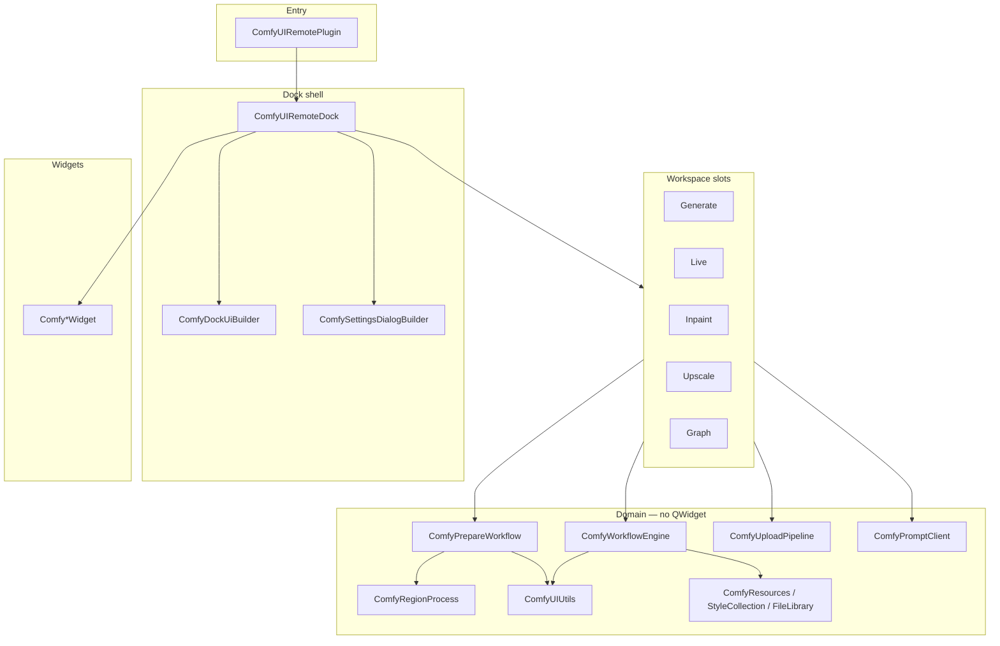

# ComfyUI Remote — Architecture

One-page map of the plugin after the [unification plan](docs/ARCHITECTURE_UNIFICATION_PLAN.md). Sources live in **domain folders** (`dock/`, `utils/`, …); `#include "ComfyFoo.h"` stays flat via `cmake/ComfyIncludeDirs.cmake`.

## Source folders

| Folder | Role |
|--------|------|
| `plugin/` | Krita module entry |
| `dock/` | Dock shell + workspace slot TUs |
| `ui/` | Theme, widgets, dock UI builder, generate CTA |
| `runners/` | Upload/poll/submit per workspace |
| `workflow/` | Prepare pipeline + workflow engine |
| `utils/` | Shared helpers (mask, document, custom workflow) |
| `core/` | Resources, regions, styles, control |
| `network/` | HTTP client + upload pipeline |
| `settings/` | Settings dialog builder |
| `history/` | History storage, apply, preview |

Full map: [README.md](README.md#source-layout-domain-folders).

## Layers

## Rules

| Layer | Owns | Must not own |
|-------|------|--------------|
| **Dock shell** | Widgets, signals, workspace switch, status | HTTP loops, workflow graph internals |
| **Workspace `.cpp`** | Submit → upload → poll → finish for one mode | Unrelated workspace state, settings dialog build |
| **Domain** | `Input`/`Result` structs, ComfyUI JSON | Direct UI mutation (callbacks only) |
| **Widgets** | Single control; signals | Server I/O |

## Key modules

| Module | Role |
|--------|------|
| `ComfyGenerateRunner` | Generate click + batch + upload + queue advance + animation/cancel (split TUs) |
| `ComfyGenerateRunnerInternal` | Batch capture stash, custom Krita injection expand, animation frame params |
| `ComfyGenerateRunnerPoll.cpp` | Generate poll tick + image download + history/animation batch finish |
| `ComfyGenerateRunnerBatch.cpp` | Batch submit loop + per-frame dispatch |
| `ComfyGenerateRunnerUpload.cpp` | LoRA/control/mask upload pipeline + workflow finalize |
| `ComfyGenerateRunnerGenerate.cpp` | Generate button click handler |
| `ComfyGenerateRunnerAnimation.cpp` | Animation generate/import + queue cancel |
| `ComfyGenerateUi` | Generate button CTA + inpaint mode menus |
| `ComfyPrepareGenerateWorkflow` | Generate workflow prep input + `prepare()` |
| `ComfyLiveRunner` | Live tick + upload/submit + poll (split TUs) |
| `ComfyLiveRunnerInternal` | Live result crop + upload URL helper |
| `ComfyInpaintRunner` | Inpaint click + upload/submit + poll (split TUs) |
| `ComfyControlRunner` | Control preview + layer job run/poll (split TUs) |
| `ComfyControlRunnerInternal` | Layer-tree lookup + canvas crop helpers |
| `ComfyUpscaleRunner` | Upscale click + upload/submit + poll (split TUs) |
| `ComfyUpscaleRunnerInternal` | Region/control selection + mask PNG helper |
| `ComfyHistoryInternal` | History JSON, list labels, preview layer helpers |
| `ComfyUIRemoteDockHistory.cpp` | History list refresh + selection |
| `ComfyHistoryPreview.cpp` | History preview overlay + live result preview |
| `ComfyHistoryActions.cpp` | History copy/save/discard/clear/re-run |
| `ComfyHistoryApply.cpp` | Apply result + `handleGenerationFinished` |
| `ComfyHistoryDocument.cpp` | Document-embedded history persist/load |
| `ComfyPollRunnerCommon` | Shared history poll error/running/timeout dispatch (all workspace runners) |
| `ComfyDockUiBuilder` | Docker shell (`buildDockShell`, finalize, attach) |
| `ComfyDockUiBuilderWelcome.cpp` | Welcome page |
| `ComfyDockUiBuilderChrome.cpp` | Shared chrome |
| `ComfyDockUiBuilderGenerate.cpp` | Generate workspace orchestrator |
| `ComfyDockUiBuilderGenerateInternal` | Section builders (upscale, prompt, strength, inpaint, modes, queue, control) |
| `ComfyDockUiBuilderGraph.cpp` | Graph workspace |
| `ComfyDockUiBuilderHistory.cpp` | History panel |
| `ComfyDockUiBuilderRegions.cpp` | Regions panel |
| `ComfySettingsDialogBuilder` | Settings tabs (Connection, Styles, Diffusion, Interface, Performance) |
| `ComfySettingsDialogBuilderInternal` | Builtin style read-only edit filter + NSFW warning session flag |
| `ComfyUploadPipeline` | Sequential LoRA / control / mask uploads |
| `ComfyPromptClient` | Prompt submit + history poll |
| `ComfyPrepareWorkflow` | Canvas capture, mask, region prep (generate + live) |
| `ComfyWorkflowEngine` | Workflow JSON by family (generate, inpaint, upscale, animation, custom) |
| `ComfyWorkflowEngineGraphDetail.cpp` | Graph node insert helpers + workflow templates |
| `ComfyWorkflowEngineCheckpoint.cpp` | Checkpoint + LoRA chain, `resolveArch` |
| `ComfyWorkflowEngineGraph.cpp` | Graph context discovery, conditioning orchestration, style options |
| `ComfyWorkflowEngineSamplerDetail.cpp` | SamplerCustomAdvanced replacement helpers |
| `ComfyWorkflowEngineConditioning.cpp` | IP-Adapter, ControlNet, regional prompt layers |
| `ComfyUIUtilsCustomWorkflow*` | UI→API convert, param slots/validation, style/prompt eval, canvas capture |
| `ComfyUIUtils*` | Paths, settings, prompt, mask (create/ops), document (ui-json/capture), HTTP, workflow prefs, object_info, presets, plugin meta, tiling, sampling |
| `ComfyUIRemoteDock.cpp` | Dock shell: ctor, canvas, poll/status, event filter |
| `ComfyUIRemoteDockShellInternal` | Layer-tree / combo helpers shared across dock TUs |
| `ComfyUIRemoteDockCustomWorkflow.cpp` | Embedded custom workflow editor persist |
| `ComfyUIRemoteDockDocumentSync.cpp` | Document ui.json sync + region/model apply |
| `ComfyUIRemoteDockDocumentDefaults.cpp` | Per-document style/checkpoint defaults |
| `ComfyUIRemoteDockWelcome.cpp` | Welcome page + plugin update |
| `ComfyUIRemoteDockStyles.cpp` | Style tab / checkpoint combo / quality presets |
| `ComfyUIRemoteDockShortcuts.cpp` | KisAction ai_diffusion_* shortcuts |
| `ComfyUIRemoteDockAnimation.cpp` | Animation workspace UI |
| `ComfyUIRemoteDockInpaintPersist.cpp` | Inpaint workspace document persist |
| `ComfyUIRemoteDockPromptUi.cpp` | Tag completion + queue popup widgets |
| `ComfyUIRemoteDockRegionsPersist.cpp` | Regions list persist + pose guide |
| `ComfyHistoryStorage.cpp` | History cache size + usage label |
| `ComfyUIRemoteDock*.cpp` (other) | Per-workspace slot delegates |

## Include direction

`Widgets` → `Domain` → `Utils`. Domain must not include `ComfyUIRemoteDockPrivate.h`.

## Upstream traceability

See [PORT_TRACEABILITY.md](docs/PORT_TRACEABILITY.md) and per-feature port plans under `docs/`.
