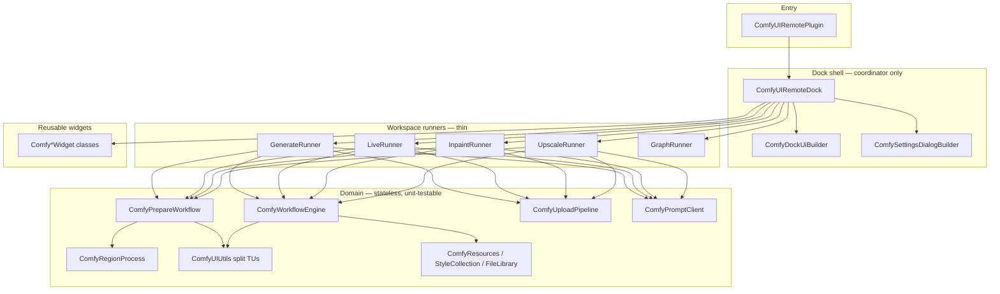

# Architecture Unification Plan — ComfyUI Remote Docker

**Goal:** One coherent internal architecture — DRY, easy to navigate, safe to extend — without breaking faithful-port parity with upstream `krita-ai-diffusion`.

**Non-goals:** Rewriting upstream behavior, or a single “big bang” refactor PR. On-disk layout uses **domain folders** (2026-06-27); filenames and namespaces stay `Comfy*`-prefixed.

**Related:** [PORT_TRACEABILITY.md](PORT_TRACEABILITY.md), [INPAINT_CONTEXT_PORT_PLAN.md](INPAINT_CONTEXT_PORT_PLAN.md), existing tab port plans.

---

## 1. Problem statement

The plugin works and port coverage is broad, but **structure grew faster than architecture**:

| Symptom | Where | Impact |
|---------|-------|--------|
| God struct (~186 members) | `ComfyUIRemoteDockPrivate.h` | Every workspace change touches one blob |
| Copy-pasted upload chains | Generate / Live / Inpaint / Upscale `.cpp` | Bug fixes (stuck buttons, error paths) need 4× edits |
| Junk-drawer utils (~6k lines, ~100 functions) | `ComfyUIUtils.cpp` | Hard to find mask vs prompt vs path logic |
| Monolithic UI builders | `ComfyUIRemoteDock.cpp` ctor (~2k lines), `slotConfigureHelp()` (~2.2k lines) | Onboarding cost, merge conflicts |
| Overlapping prepare paths | `ComfyPrepareGenerateWorkflow`, `ComfyPrepareLiveWorkflow` | Same mask/selection/region flow maintained twice |
| Dock owns orchestration + UI + HTTP | `ComfyUIRemoteDock*.cpp` (~25k lines total) | Workspaces not isolated |

**Principle:** Extract **behavior** into small, testable modules. Keep **Qt widgets and signals** in the dock. Match upstream module boundaries where Python already splits concerns (`model.py`, `workflow.py`, `document.py`, `ui/generation.py`, etc.).

---

## 2. Target architecture (layers)



### Layer rules

| Layer | Owns | Must not own |
|-------|------|--------------|
| **Dock shell** | Widget pointers, signal wiring, workspace switching, status bar, delegating user actions | Raw HTTP upload loops, workflow JSON graph internals, mask math |
| **Workspace runner** | One workspace’s submit → upload → poll → finish sequence; reads/writes dock `Private` via narrow interface | Settings dialog construction, unrelated workspace state |
| **Domain** | Pure or near-pure logic; `Input`/`Result` structs; no `QWidget*` | Direct UI mutation (callbacks only) |
| **Widgets** | Single control or list; emit signals | Server I/O, document annotations |

### Naming convention (clear `Comfy*` prefixes; domain folders on disk)

| Prefix / name | Responsibility |
|----------------|----------------|
| `ComfyPrepareWorkflow` | Unified canvas capture + mask + region prep (replaces dual prepare types) |
| `ComfyUploadPipeline` | Sequential LoRA / control / mask uploads to ComfyUI |
| `ComfyPromptClient` | POST prompt, poll `/history/{id}`, parse outputs/errors, queue advance hooks |
| `ComfyDockUiBuilder` | Main docker layout construction (extracted from ctor) |
| `ComfySettingsDialogBuilder` | One builder function per settings tab |
| `ComfyUIUtils*` | Split implementation files, **single** `ComfyUIUtils` namespace in header |
| `ComfyUIRemoteDock*Runner` (optional later) | Free functions or small structs in existing `ComfyUIRemoteDockGenerate.cpp` etc., called from dock slots |

---

## 3. DRY targets (concrete)

### 3.1 Upload pipeline (highest ROI)

**Today:** Four near-identical chains:

```
uploadNext*LoraFile → uploadNext*ControlImage → uploadNext*RegionMask → finalize*AndSubmit
```

**Target:** `ComfyUploadPipeline`

```cpp
namespace ComfyUploadPipeline {

struct AssetBatch {
    QStringList loraPaths;
    QList<ControlUpload> controlImages;  // path + metadata already used today
    QStringList regionMasks;
};

struct Callbacks {
    std::function<void(bool isUpload)> setProgressKind;
    std::function<void(const QString &, bool isError)> setStatus;
    std::function<void()> onComplete;   // finalize*AndSubmit
    std::function<void()> onAbort;     // re-enable UI
};

void start(QNetworkAccessManager *nam,
           const QUrl &baseUrl,
           AssetBatch batch,
           Callbacks cb,
           QObject *context);

} // namespace
```

**Migration:** Generate first (best test coverage), then Inpaint, Live, Upscale. Delete duplicated `uploadNext*` bodies; dock slots become thin wrappers that populate `AssetBatch` from `Private`.

**Tests:** Extend `ComfyPortP52Test` or add `ComfyUploadPipelineTest` with mock HTTP — assert order, error propagation, abort on missing file.

---

### 3.2 Prompt client / polling

**Today:** Poll logic in ctor lambda, `slotLivePoll`, `slotInpaintPoll`, `slotUpscalePoll`, control-layer job poll — all parse history JSON and handle queue advance similarly.

**Target:** `ComfyPromptClient`

```cpp
struct PromptSubmitResult { QString promptId; QString error; };
struct HistoryPollResult { enum State { Running, Done, Error }; ... };

PromptSubmitResult submit(QNetworkAccessManager *, const QUrl &, const QJsonObject &workflow);
void pollHistory(QNetworkAccessManager *, const QUrl &, const QString &promptId,
                 std::function<void(HistoryPollResult)> onResult);
```

Dock keeps **when** to poll (timers, workspace-specific finish handlers). Client owns **how** to talk to ComfyUI.

---

### 3.3 Unified workflow preparation

**Today:** `ComfyPrepareGenerateWorkflow` + `ComfyPrepareLiveWorkflow` share ~80% logic (arch resolve, selection mask, region mask, bounds, preprocess).

**Target:** Single `ComfyPrepareWorkflow` namespace:

```cpp
struct PrepareFlags {
    bool requireMask = false;
    bool captureImage = true;
    bool isLive = false;
    bool regionOnly = false;
    bool editMode = false;
    // existing Generate PrepareFlags fields …
};

struct Input { /* merged fields */ };
struct Result { /* merged Result; workflowKind, inpaintParams, etc. */ };

Result prepare(const Input &, PrepareFlags);
```

Keep thin aliases during migration:

```cpp
namespace ComfyPrepareGenerateWorkflow { Result prepare(const Input &); }
namespace ComfyPrepareLiveWorkflow { Result prepare(const Input &); }  // delegates
```

**Parity check:** Same inputs as upstream `_prepare_workflow` / `_prepare_live_workflow` — trace in [INPAINT_CONTEXT_PORT_PLAN.md](INPAINT_CONTEXT_PORT_PLAN.md).

---

### 3.4 Split `ComfyUIUtils` (implementation only)

**Header stays** `ComfyUIUtils.h` (stable include for whole plugin).

**New `.cpp` files** (CMake append only):

| File | Contents (examples) |
|------|---------------------|
| `ComfyUIUtilsPaths.cpp` | `userDataDir`, plugin dir, log dir, migration |
| `ComfyUIUtilsSettings.cpp` | `loadSettingsJson`, `saveSettingsJson`, comment stripping |
| `ComfyUIUtilsPrompt.cpp` | wildcards, tag CSV, weight syntax, layer placeholders |
| `ComfyUIUtilsMaskCreate.cpp` / `MaskOps.cpp` | selection → mask, raster expand, inpaint params |
| `ComfyUIUtilsCustomWorkflow*.cpp` | ETN eval, param slots, mask prepare for custom graph |
| `ComfyUIUtilsDocumentUiJson.cpp` / `DocumentCapture.cpp` | ui.json merge, history encode; canvas/layer capture |
| `ComfyUIUtilsHttp.cpp` | request headers, history error parsing |

Move functions in **dependency order** (leaf helpers first). No signature changes.

---

### 3.5 `Private` struct grouping

**Target:** Nested structs in `ComfyUIRemoteDockPrivate.h` — same members, grouped:

```cpp
struct GenerateUi { /* widgets */ };
struct GenerateRuntime { /* upload flags, pending workflow, batch queue slice */ };
struct LiveUi { ... };
struct LiveRuntime { ... };
struct InpaintRuntime { ... };
struct UpscaleRuntime { ... };
struct ConnectionUi { ... };
struct HistoryState { ... };
struct DocumentSyncState { ... };

struct Private {
    GenerateUi generate;
    GenerateRuntime generateRt;
    LiveUi live;
    LiveRuntime liveRt;
    // ...
};
```

**Migration:** Mechanical rename `m_d->btnGenerate` → `m_d->generate.btnGenerate` in one workspace per PR. Use scoped search-replace; run tests after each workspace.

---

### 3.6 UI construction extraction

| Extract from | Into | Functions |
|--------------|------|-----------|
| `ComfyUIRemoteDock` ctor | `ComfyDockUiBuilder.cpp` | `buildWelcomePage`, `buildGenerateWorkspace`, `buildGraphWorkspace`, `buildHistoryPanel`, `buildRegionsPanel`, `finalizeContentScroll`, `finalizeGenerateWorkspaceLayout`, `buildSharedChrome` |
| `slotConfigureHelp` | `ComfySettingsDialogBuilder*.cpp` | `buildConnectionTab`, `buildStylesTab`, `buildDiffusionTab`, `buildInterfaceTab`, `buildPerformanceTab` |

Builders return structs of widget pointers; dock ctor **wires signals** and stores pointers in `Private`.

**Critical:** Preserve existing lifetime rules (Settings tab widgets that must outlive the dialog stay `Private` members — see comments in `ComfyUIRemoteDockPrivate.h` L96–99).

---

### 3.7 `ComfyWorkflowEngine` split (later)

Split **implementation `.cpp` only** by workflow family:

- `ComfyWorkflowEngineGenerate.cpp` — text2img, refine
- `ComfyWorkflowEngineInpaint.cpp` — inpaint, refine_region
- `ComfyWorkflowEngineUpscale.cpp`
- `ComfyWorkflowEngineAnimation.cpp`
- `ComfyWorkflowEngineCustom.cpp` — ETN expand

Shared helpers stay in anonymous namespace in a `ComfyWorkflowEngineCommon.cpp` or top of main file.

---

## 4. Phased rollout

Each phase = **one or more small PRs**, green CI, no behavior change unless noted.

| Phase | Name | Scope | Risk | Done when |
|-------|------|-------|------|-----------|
| **A0** | Baseline | Land this doc; add `ARCHITECTURE.md` one-page layer diagram in repo root of plugin (optional) | None | Doc reviewed |
| **A1** | Upload pipeline | `ComfyUploadPipeline` + Generate LoRA/control path | Done | `ComfyUploadPipelineTest`, generate upload uses `Run` |
| **A2** | Upload pipeline | Inpaint, Live, Upscale + Generate region masks | Done | No duplicate `uploadNext*Lora/Control` |
| **B1** | Prompt client | Extract history poll + submit helpers | Done | Poll/submit via `ComfyPromptClient`; `ComfyPromptClientTest` |
| **C1** | Utils split | Paths + Settings `.cpp` | Done | `ComfyUIUtilsPaths.cpp`, `ComfyUIUtilsSettings.cpp` in CMake |
| **C2** | Utils split | Prompt + Mask | Done | `ComfyUIUtilsPrompt.cpp`, `ComfyUIUtilsMaskCreate.cpp` + `ComfyUIUtilsMaskOps.cpp` (N10) |
| **C3** | Utils split | Custom workflow + Document + Http | Done | `ComfyUIUtilsHttp.cpp`, custom workflow (N9), document (N10) |
| **D1** | Private grouping | `GenerateUi` + `GenerateRuntime` | Done | Nested structs in `ComfyUIRemoteDockPrivate.h`; refs use `generate.*` / `generateRt.*` |
| **D2** | Private grouping | Live, Inpaint, Upscale, History | Done | `live`/`liveRt`, `inpaint`/`inpaintRt`, `upscale`/`upscaleRt`, `history` nested structs |
| **E1** | Settings builder | Connection + Styles tabs extracted | Done | `ComfySettingsDialogBuilder.cpp`; `slotConfigureHelp` delegates tab build |
| **E2** | Settings builder | Diffusion + Interface + Performance | Done | All five settings tabs in `ComfySettingsDialogBuilder`; `slotConfigureHelp` ~320 lines |
| **F1** | Dock UI builder | Welcome + shared chrome | Done | `ComfyDockUiBuilder`; ctor delegates shell/welcome/chrome |
| **F2** | Dock UI builder | Generate + Graph workspace bodies | Done | `buildGenerateWorkspace` / `buildGraphWorkspace` in `ComfyDockUiBuilder` |
| **G1** | Unified prepare | Merge prepare implementations behind flags | Done | `ComfyPrepareWorkflow`; generate/live namespaces delegate |
| **H1** | Workflow engine split | `.cpp` file split only | Done | `ComfyWorkflowEngineInternal.h`; generate/inpaint/upscale/custom/animation TUs; golden tests unchanged |
| **F3** | Dock UI builder | History + Regions panels | Done | `buildHistoryPanel` / `buildRegionsPanel` in `ComfyDockUiBuilder`; ctor delegates |
| **F4** | Dock UI builder | Scroll finalize + generate layout | Done | `finalizeContentScroll` / `finalizeGenerateWorkspaceLayout` in builder |
| **I1** | Generate runner | Poll tick out of ctor | Done | `ComfyGenerateRunner::onPollTimer`; ctor one-liner |
| **I3** | Inpaint/upscale runners | Poll ticks out of workspace slots | Done | `ComfyInpaintRunner` / `ComfyUpscaleRunner::onPollTimer` |
| **I4** | Live runner | Live poll tick out of workspace slot | Done | `ComfyLiveRunner::onPollTimer`; `cropLiveResultToTarget` colocated |
| **I5** | Control runner | Preview + layer job poll ticks | Done | `ComfyControlRunner::onPreviewPollTimer` / `onLayerJobPollTimer` |
| **I5b** | Control runner submit | Preview run + sync/stop helpers → runner | Done | `onPreviewRun`, `stopPreviewPolling`, `syncPreviewRangeFromSettings`, `syncPoseGuidePeopleCountFromSettings` |
| **I5c** | Control runner submit | Layer job run + stop/refresh/import → runner | Done | `onLayerJobRun`, `stopLayerJobPolling`, `refreshLayerJobGenerateButtons`; ControlGenerate TU **27** lines |
| **J1** | Generate poll DRY | `handleHistoryFetch` + queue advance helpers | Done | `failGeneratePoll`, `advanceGenerateJobQueue`; generate poll uses `ComfyPollRunnerCommon` |
| **K1** | History TU split | `.cpp` file split only | Done | `ComfyHistoryInternal`; Preview/Actions/Apply/Document TUs; list TU **148** lines |
| **L1** | Generate TU cleanup | Animation + queue cancel → runner | Done | `onGenerateAnimation`, `onImportAnimation`, `onCancelQueue`, `cancelCurrentJob`, `cancelQueuedJobs`; Generate TU **596** lines |
| **L2** | Generate TU cleanup | Prep input + inpaint menus + options UI | Done | `ComfyPrepareGenerateWorkflow::inputFromDock`, `ComfyGenerateUi`; Generate TU **142** lines |
| **M1** | Dock shell split | `ComfyUIRemoteDock.cpp` → domain TUs | Done | Shell **625** lines; 11 domain TUs + `ComfyUIRemoteDockShellInternal` |
| **M2** | Shell widget dedup | Shared widgets/helpers in ShellInternal | Done | `ComfyPromptPlainTextEdit`, `StrengthSpinBox`, `LiveSpinnerWidget`, `setComboCurrentItemData`; builder + shell use one copy |
| **M3** | Connection TU split | `ComfyUIRemoteDockConnection.cpp` → domain TUs | Done | `ComfyConnectionInternal` **142**; ObjectInfo **279** / Ui **162** / Probe **352** |
| **N1** | Generate runner poll | `onPollTimer` → `ComfyGenerateRunnerPoll.cpp` | Done | Poll **386** |
| **N2** | Generate runner domain split | batch/graph/upload/generate/animation TUs + `ComfyGenerateRunnerInternal` | Done | Internal **653**; Poll **388** / Batch **531** / GraphLive **159** / Upload **605** / Generate **723** / Animation **326** |
| **N3** | Workspace runner splits | Live / Inpaint / Control → domain TUs + Internal | Done | Live **978** (4 TUs); Inpaint **936** (4 TUs); Control **955** (3 TUs); fixed invalid `this` parent in upload/submit |
| **N4** | Upscale + UI builder split | `ComfyUpscaleRunner` + `ComfyDockUiBuilder` → domain TUs | Done | Upscale **736** (4 TUs); DockUiBuilder **2108** (7 TUs, Generate **1055**) |
| **N5** | Generate workspace split | `buildGenerateWorkspace` → section TUs + Internal | Done | Orchestrator **39**; Upscale **237** / Prompt **196** / Strength **190** / SeedSize **154** / Inpaint **214** / Modes **214** / Queue **279** / Control **149** |
| **N6** | Settings dialog split | `ComfySettingsDialogBuilder.cpp` → tab TUs + Internal | Done | Internal **40**; Connection **121** / Styles **880** / Diffusion **259** / Interface **567** / Performance **550** |
| **N7** | Workflow engine common split | `ComfyWorkflowEngine.cpp` → graph/checkpoint/conditioning TUs | Done | GraphDetail **694** / Checkpoint **201** / Graph **259** / SamplerDetail **392** / Conditioning **537** |
| **N8** | Utils remainder split | `ComfyUIUtils.cpp` → domain TUs | Done | Workflow **296** / ObjectInfo **428** / Presets **365** / Plugin **248** / Tiling **327** / Sampling **385** |
| **N9** | Custom workflow split | `ComfyUIUtilsCustomWorkflow.cpp` → Convert / Params / Capture | Done | Convert **355** / Params **365** / Capture **418** |
| **N10** | Document + mask split | `ComfyUIUtilsDocument.cpp` + `ComfyUIUtilsMask.cpp` → domain TUs | Done | DocumentUiJson **617** / DocumentCapture **368** / MaskCreate **382** / MaskOps **541** |
| **N11** | Settings Styles tab split | `ComfySettingsDialogBuilderStyles.cpp` → Widgets / Sync + Internal | Done | Orchestrator **22** / Widgets **355** / Sync **618** / Internal **71** |
| **I1b** | Poll DRY | Shared history poll dispatch | Done | `ComfyPollRunnerCommon::handleHistoryFetch` in workspace runners |
| **I2** | Generate runner submit | `slotGenerate` body → runner | Done | `ComfyGenerateRunner::onGenerate`; slot one-liner |
| **I2b** | Generate runner pipeline | Batch submit + upload → runner | Done | `onBatchSubmitNext`, `beginUploadPipeline`, `finalizeWorkflowAndSubmit`, refine path |
| **I3b** | Inpaint runner submit | `slotInpaint` + upload/submit → runner | Done | `onInpaint`, `beginUploadPipeline`, `submitWorkflow`; Inpaint TU **63** lines |
| **I4b** | Live runner submit | Live tick + upload/submit chain → runner | Done | `onTick` through `submitWorkflow`; Live TU **93** lines |
| **I3c** | Upscale runner submit | Upscale click + upload/submit → runner | Done | `onUpscale` through `submitWorkflow`; Upscale TU **44** lines |
| **A0** | Baseline | One-page `ARCHITECTURE.md` in plugin root | Done | Layer diagram + module map |

**Order rationale:** Upload + poll dedup first (most copied code, most wedge bugs). Utils split and Private grouping parallelize well. Unified prepare last among domain changes — highest parity risk.

---

## 5. File map (domain folders)

Sources live under domain subfolders; `#include "ComfyFoo.h"` unchanged via `cmake/ComfyIncludeDirs.cmake`. Plugin root: `CMakeLists.txt`, `data/`, `docs/`, `scripts/`, `tests/`.

```
plugin/              ComfyUIRemotePlugin.cpp
network/             ComfyPromptClient, ComfyUploadPipeline
core/                resources, regions, styles, control/, …
ui/theme/            ComfyTheme
ui/widgets/          switches, buttons, sliders, HistoryListWidget, …
ui/builder/          ComfyDockUiBuilder* (generate/ for Generate* sections)
ui/generate/         ComfyGenerateUi
settings/            ComfySettingsDialogBuilder*
workflow/engine/     ComfyWorkflowEngine*
workflow/prepare/    ComfyPrepare*
workflow/            ComfyUIWorkflows
utils/               ComfyUIUtils* (mask/, document/, custom_workflow/)
runners/             generate/, inpaint/, live/, upscale/, control/, poll common
dock/                ComfyUIRemoteDock* (connection/, generate/, inpaint/, …)
history/             ComfyHistory*
```

Representative files (same names as before, new paths):

```
ComfyUIRemoteDock.cpp/h            # ctor, canvas, polling, status (shell)
ComfyUIRemoteDockShellInternal.cpp/h # shared widgets (prompt edit, strength spin, live spinner) + layer-list / combo helpers
ComfyUIRemoteDockCustomWorkflow.cpp
ComfyUIRemoteDockDocumentSync.cpp
ComfyUIRemoteDockDocumentDefaults.cpp
ComfyUIRemoteDockWelcome.cpp
ComfyUIRemoteDockStyles.cpp
ComfyUIRemoteDockShortcuts.cpp
ComfyUIRemoteDockAnimation.cpp
ComfyUIRemoteDockInpaintPersist.cpp
ComfyUIRemoteDockPromptUi.cpp
ComfyUIRemoteDockRegionsPersist.cpp
ComfyHistoryStorage.cpp
ComfyUIRemoteDockPrivate.h         # grouped Private structs
ComfyPrepareGenerateWorkflow.cpp/h   # generate prepare input + delegate prepare
ComfyGenerateUi.cpp/h                  # generate CTA, inpaint mode menus
ComfyUIRemoteDockGenerate.cpp      # generate slot delegates only
ComfyUIRemoteDockLive.cpp
ComfyUIRemoteDockInpaint.cpp
ComfyUIRemoteDockUpscale.cpp
ComfyUIRemoteDockHistory.cpp       # list refresh + selection
ComfyHistoryInternal.cpp/h           # shared history helpers
ComfyHistoryPreview.cpp
ComfyHistoryActions.cpp
ComfyHistoryApply.cpp
ComfyHistoryDocument.cpp
ComfyConnectionInternal.cpp/h           # §13.71 missing-resources HTML + detected-models label
ComfyUIRemoteDockConnectionObjectInfo.cpp
ComfyUIRemoteDockConnectionUi.cpp
ComfyUIRemoteDockConnectionProbe.cpp
ComfyUIRemoteDockSettings.cpp      # slotConfigureHelp → builder calls only
ComfyUIRemoteDockRegions.cpp
ComfyUIRemoteDockPresets.cpp
ComfyUIRemoteDockControl*.cpp
ComfyUIRemoteDockWebWorkflow.cpp

ComfyDockUiBuilder.cpp/h           # shell + finalize
ComfyDockUiBuilderWelcome.cpp
ComfyDockUiBuilderChrome.cpp
ComfyDockUiBuilderGenerate.cpp/h      # orchestrator
ComfyDockUiBuilderGenerateInternal.h
ComfyDockUiBuilderGenerateUpscale.cpp
ComfyDockUiBuilderGeneratePrompt.cpp
ComfyDockUiBuilderGenerateStrength.cpp
ComfyDockUiBuilderGenerateSeedSize.cpp
ComfyDockUiBuilderGenerateInpaint.cpp
ComfyDockUiBuilderGenerateModes.cpp
ComfyDockUiBuilderGenerateQueue.cpp
ComfyDockUiBuilderGenerateControl.cpp
ComfyDockUiBuilderGraph.cpp
ComfyDockUiBuilderHistory.cpp
ComfyDockUiBuilderRegions.cpp
ComfySettingsDialogBuilder.h
ComfySettingsDialogBuilderInternal.cpp/h   # builtin style edit filter + NSFW session flag
ComfySettingsDialogBuilderConnection.cpp
ComfySettingsDialogBuilderStyles.cpp
ComfySettingsDialogBuilderStylesInternal.h
ComfySettingsDialogBuilderStylesWidgets.cpp
ComfySettingsDialogBuilderStylesSync.cpp
ComfySettingsDialogBuilderDiffusion.cpp
ComfySettingsDialogBuilderInterface.cpp
ComfySettingsDialogBuilderPerformance.cpp

ComfyGenerateRunnerInternal.cpp/h   # shared batch/custom-workflow/animation helpers
ComfyGenerateRunnerPoll.cpp        # poll tick + download/history finish
ComfyGenerateRunnerBatch.cpp       # batch submit loop + dispatch
ComfyGenerateRunnerGraphLive.cpp   # custom graph live resubmit
ComfyGenerateRunnerUpload.cpp      # LoRA/control/mask upload + finalize
ComfyGenerateRunnerGenerate.cpp    # generate button click
ComfyGenerateRunnerAnimation.cpp   # animation import + queue cancel
ComfyInpaintRunnerInternal.cpp/h
ComfyInpaintRunnerPoll.cpp
ComfyInpaintRunnerInpaint.cpp
ComfyInpaintRunnerUpload.cpp
ComfyUpscaleRunnerInternal.cpp/h
ComfyUpscaleRunnerUpscale.cpp
ComfyUpscaleRunnerUpload.cpp
ComfyUpscaleRunnerPoll.cpp
ComfyLiveRunnerInternal.cpp/h
ComfyLiveRunnerTick.cpp
ComfyLiveRunnerUpload.cpp
ComfyLiveRunnerPoll.cpp
ComfyControlRunnerInternal.cpp/h
ComfyControlRunnerLayerJob.cpp
ComfyControlRunnerPreview.cpp
ComfyUIRemoteDockControlGenerate.cpp # layer job slot delegates only
ComfyPollRunnerCommon.cpp/h          # shared history poll dispatch
ComfyUploadPipeline.cpp/h          # NEW
ComfyPromptClient.cpp/h            # NEW
ComfyPrepareWorkflow.cpp/h         # NEW — replaces dual prepare (aliases kept)

ComfyWorkflowEngine.h
ComfyWorkflowEngineInternal.h
ComfyWorkflowEngineGraphDetail.cpp      # detail:: graph insert + template parse
ComfyWorkflowEngineCheckpoint.cpp       # checkpoint LoRA load + resolveArch
ComfyWorkflowEngineGraph.cpp            # graph context + generation conditioning orchestration
ComfyWorkflowEngineSamplerDetail.cpp    # detail:: SamplerCustomAdvanced helpers
ComfyWorkflowEngineConditioning.cpp     # IP-Adapter, ControlNet, regional prompts
ComfyWorkflowEngineGenerate.cpp
ComfyWorkflowEngineInpaint.cpp
…

ComfyUIUtils.h                     # unchanged public API
ComfyUIUtilsPaths.cpp
ComfyUIUtilsSettings.cpp
ComfyUIUtilsPrompt.cpp
ComfyUIUtilsMaskCreate.cpp
ComfyUIUtilsMaskOps.cpp
ComfyUIUtilsDocumentUiJson.cpp
ComfyUIUtilsDocumentCapture.cpp
ComfyUIUtilsHttp.cpp
ComfyUIUtilsCustomWorkflowConvert.cpp  # UI→API graph conversion
ComfyUIUtilsCustomWorkflowParams.cpp   # ETN param slots + validation
ComfyUIUtilsCustomWorkflowCapture.cpp  # style/prompt eval + Krita canvas capture
ComfyUIUtilsWorkflow.cpp           # workflow prefs + control preview graph
ComfyUIUtilsObjectInfo.cpp         # object_info parsing + spec §13.58 node list
ComfyUIUtilsPresets.cpp            # sampler/control preset cache
ComfyUIUtilsPlugin.cpp             # version, color mode, performance stats
ComfyUIUtilsTiling.cpp             # DiffusionTileLayout + extent prep
ComfyUIUtilsSampling.cpp           # resolve sampling, edit mode, diagnostics

ComfyRegionProcess.*  ComfyResources.*  ComfyStyleCollection.*  …  # unchanged roles
Comfy*Widget.*                     # unchanged — reusable UI components
```

---

## 6. Testing gates (every phase)

```bash
# From Krita build tree
ctest -R 'ComfyPort|ComfyWorkflow|ComfyUIRemoteDock' --output-on-failure

# Port checklist
./plugins/dockers/comfyui_remote/scripts/port_ci_checklist.sh
```

| Change type | Required proof |
|-------------|--------------|
| Upload / poll refactor | `ComfyPortP52Test`; no new stuck-button path without `onAbort` |
| Prepare merge | `ComfyRegionProcess` tests; manual inpaint matrix rows (Fill, Refine, Live) |
| Utils split | Existing unit tests only — no new behavior |
| UI builder extract | Visual parity; Settings opens on Android without crash |
| Workflow engine split | `ComfyWorkflowEngineGoldenTest`, fixture normalize |

Add **characterization tests** before risky refactors: capture current workflow JSON tail or history error string, assert unchanged after extract.

---

## 7. Coding rules (keep architecture unified)

1. **No new logic in the dock ctor** — only connect signals; call `ComfyDockUiBuilder`.
2. **No raw `QNetworkReply` loops in workspace files** — use `ComfyUploadPipeline` / `ComfyPromptClient`.
3. **New ComfyUI-facing behavior** → domain module with `Input`/`Result`, unit test, upstream § reference in comment.
4. **One workspace per PR** when touching `Private` member paths.
5. **Preserve `FAITHFUL_PORT` comments** — move with the code, don’t delete traceability.
6. **Header include direction:** Widgets → Domain → Utils. Domain must not include `ComfyUIRemoteDockPrivate.h`.

---

## 8. What we are not doing

- A separate `src/` hierarchy or changing `#include "ComfyFoo.h"` style (paths stay flat via `ComfyIncludeDirs.cmake`).
- Introducing heavy DI frameworks or turning the dock into a generic “app shell.”
- Merging workspace `.cpp` files back together.
- Changing public plugin API or `.action` registration.
- Refactoring for refactor’s sake mid-port — **defer phase G1** if active port work targets the same code paths.

---

## 9. Success metrics

| Metric | Current (approx) | Target |
|--------|------------------|--------|
| Largest single function | ~2200 lines (`slotConfigureHelp`) | < 200 lines |
| `ComfyUIUtils.cpp` lines | ~6050 | < 800 per file |
| Duplicate upload implementations | 4 | 0 (LoRA/control/region via pipeline) |
| `Private` top-level pointer count | ~186 flat | Grouped; < 30 top-level fields |
| New feature touch surface for “add upload type” | 4 files | 1 (`ComfyUploadPipeline`) |

---

## 10. Completion status

**Pickup guide:** [`../README.md`](../README.md) — session progress, blockers, resume checklist (2026-06-27).

| Item | Status |
|------|--------|
| Implementation phases **A0–N11** | **Done** |
| Domain folder reorg (`scripts/reorganize_sources.py`) | **Done** — 136 TUs under `dock/`, `utils/`, … |
| Generate dropdown Phases 1–3 | **Done** |
| Offline gate (`scripts/port_ci_checklist.sh`) | **Pass** — P9 symbols + include path check |
| Orchestrator (`scripts/verify_all.sh`) | **Pass** offline; build step skips until KF5 |
| P10 inpaint preflight (`scripts/p10_inpaint_preflight.sh`) | **Ready** — GUI scenarios after ComfyUI + Krita |
| Full build (`cmake` + `ninja kritacomfyuiremote_static`) | **Blocked** — KF5 `-devel` not on host |
| Unit tests (`ctest -R 'ComfyPort\|ComfyWorkflow\|ComfyUIRemoteDock'`) | **Blocked** — needs build |

**One command:**

```bash
plugins/dockers/comfyui_remote/scripts/verify_all.sh              # offline (passes now)
plugins/dockers/comfyui_remote/scripts/install_kf5_build_deps.sh --verify
plugins/dockers/comfyui_remote/scripts/verify_all.sh --with-build --with-manual --with-p10
```

**User action to unblock build** (requires `sudo` password in your terminal):

```bash
plugins/dockers/comfyui_remote/scripts/install_kf5_build_deps.sh --verify
```

Or install only, then verify separately:

```bash
plugins/dockers/comfyui_remote/scripts/install_kf5_build_deps.sh
plugins/dockers/comfyui_remote/scripts/verify_all.sh --with-build
```

Or manually:

```bash
cd /home/ackeejag/source/krita/build
cmake .. -UQt5Core_DIR   # only if cmake picks broken krita-auto-1 Qt5 cache
cmake .. && ninja kritacomfyuiremote_static
ctest -R 'ComfyPort|ComfyWorkflow|ComfyUIRemoteDock' --output-on-failure
```

No further architecture-split work remains unless build surfaces compile errors.

---

## Appendix — upstream → target module map

| Upstream (Python) | Target C++ module |
|-------------------|-------------------|
| `model.py` `_prepare_workflow`, `_prepare_live_workflow` | `ComfyPrepareWorkflow` |
| `workflow.py` graph build | `ComfyWorkflowEngine` (+ split TUs) |
| `document.py` mask, capture, annotations | `ComfyUIUtilsMask`, `ComfyUIUtilsDocument`, `ComfyRegionProcess` |
| `ui/generation.py`, `ui/settings.py` | `ComfyDockUiBuilder`, `ComfySettingsDialogBuilder` |
| `client.py` / HTTP submit + poll | `ComfyPromptClient`, `ComfyUploadPipeline` |
| `style.py`, resources | `ComfyStyleCollection`, `ComfyResources`, `ComfyFileLibrary` |

This keeps the C++ layout **workable**: domain folders for navigation, familiar `Comfy*` prefixes, upstream traceable, DRY where duplication actually hurts.
